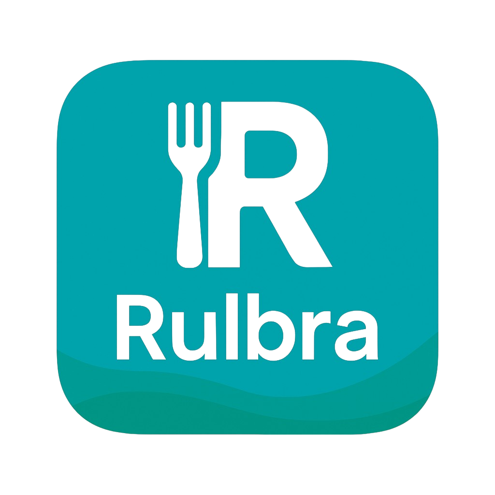
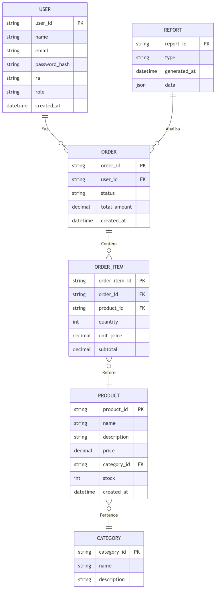

# 🍴 RUlbra




## 📘 Descrição do Projeto

O **RUlbra** é um aplicativo de delivery desenvolvido para otimizar o atendimento no Restaurante Universitário da Ulbra Torres. O sistema visa reduzir filas, minimizar atrasos nos horários de aula e facilitar o processo de escolha, pedido, pagamento e retirada de refeições por parte dos alunos. 

## 🎯 Objetivo do Sistema

Oferecer aos usuários:
- Visualização do cardápio em tempo real
- Realização de pedidos com agendamento de retirada
- Relatórios gerenciais para controle de consumo e estoque

---

## 🗄️ Propósito do Banco de Dados

O banco de dados é o núcleo de armazenamento do sistema, sendo responsável por:

- Gerenciar usuários (alunos, funcionários)
- Armazenar produtos e categorias
- Registrar pedidos e seus respectivos itens
- Gerar relatórios gerenciais sobre vendas e consumo

---

## 🧾 Collections e Estrutura

### 🔹 `users`
- **Propósito:** Armazenar dados dos usuários do sistema
- **Exemplo:**
```json
{
  "user_id": "u001",
  "name": "Maria Oliveira",
  "email": "maria.oliveira@ulbra.br",
  "password_hash": "hashed123",
  "ra": "2020123456",
  "role": "student",
  "created_at": "2025-06-01T08:00:00Z"
}
```

---

### 🔹 `products`
- **Propósito:** Armazenar refeições, lanches e bebidas disponíveis
- **Exemplo:**
```json
{
  "product_id": "p101",
  "name": "Prato Executivo",
  "description": "Arroz, feijão, carne, salada e sobremesa",
  "price": 10.50,
  "category_id": "c01",
  "stock": 200,
  "created_at": "2025-06-01T09:00:00Z"
}
```

---

### 🔹 `categories`
- **Propósito:** Classificar produtos por tipo
- **Exemplo:**
```json
{
  "category_id": "c01",
  "name": "Almoço",
  "description": "Refeições principais do dia"
}
```

---

### 🔹 `orders`
- **Propósito:** Armazenar os pedidos realizados
- **Exemplo:**
```json
{
  "order_id": "o789",
  "user_id": "u001",
  "status": "completed",
  "total_amount": 21.00,
  "created_at": "2025-06-10T12:30:00Z"
}
```

---

### 🔹 `order_items`
- **Propósito:** Itens associados a um pedido
- **Exemplo:**
```json
{
  "order_item_id": "oi123",
  "order_id": "o789",
  "product_id": "p101",
  "quantity": 2,
  "unit_price": 10.50,
  "subtotal": 21.00
}
```

---

### 🔹 `reports`
- **Propósito:** Armazenar relatórios de desempenho e consumo
- **Exemplo:**
```json
{
  "report_id": "r202506",
  "type": "monthly_sales",
  "generated_at": "2025-06-11T10:00:00Z",
  "data": {
    "total_orders": 153,
    "total_revenue": 1620.50
  }
}
```

---

## 🔗 Relacionamentos entre Collections

| Relacionamento         | Tipo        | Justificativa                              |
|------------------------|-------------|--------------------------------------------|
| orders → users         | Referência  | `user_id` como chave estrangeira            |
| orders → order_items   | Referência  | `order_id` usado para vincular itens        |
| order_items → products | Referência  | `product_id` como FK                       |
| products → categories  | Referência  | `category_id` como FK                      |

Utilizamos **referência** para manter a normalização, facilitar a escalabilidade e evitar redundância de dados.

---

## 📊 Relatórios Relevantes

1. Total de vendas por mês  
2. Produtos mais vendidos  
3. Alunos com mais pedidos no mês  
4. Total de pedidos por categoria  
5. Média de valor gasto por usuário  
6. Estoque atual por produto  
7. Receita total por categoria  
8. Histórico de consumo individual (por RA)

---

## 🧱 Modelagem do Sistema

Abaixo está o diagrama da modelagem lógica das entidades:




---

## 🛠️ Tecnologias Utilizadas

- **Backend:** Laravel 12.x + MongoDB
- **Banco:** MongoDB com collections estruturadas
- **Documentação:** [Laravel MongoDB Docs](https://laravel.com/docs/12.x/mongodb)

---

## 🧪 Estrutura de Entrega

- `README.md` com explicações e diagrama
- Base de dados MongoDB com 50 registros por collection
- Scripts `.js/.json` para povoamento
- Microserviço Laravel com 4 endpoints para relatórios

---

## 👩‍🏫 Informações Acadêmicas

| Detalhe     | Informação                                     |
|-------------|------------------------------------------------|
| 🎓 Projeto   | **RUlbra – Sistema de Delivery Universitário** |
| 📚 Disciplina | Banco de Dados                                |
| 👨‍🏫 Professor | Tiago Dias                                     |
| 👩‍💻 Alunas    | Gabriela Anjos e S. Heloisa Guincheski         |

